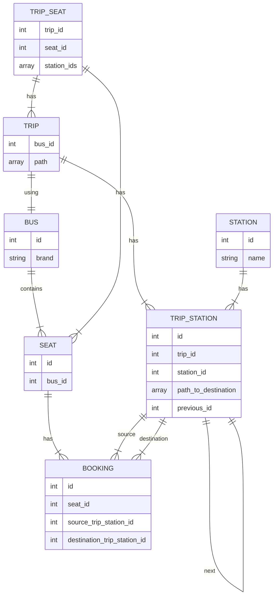

# Bus Booking System

## Requirements

 1. Egypt's cities as stations [Cairo, Giza, AlFayyum, AlMinya, Asyut...]
 2. Predefined trips between 2 stations that cross over in-between stations.
    1. ex: Cairo to Asyut trip that crosses over AlFayyum -firstly- then AlMinya.
 3. Bus for each trip, each bus has 12 available seats to be booked by users, each seat has an unique id.
 4. Users can book an available trip seat.

## Design

### ERD

