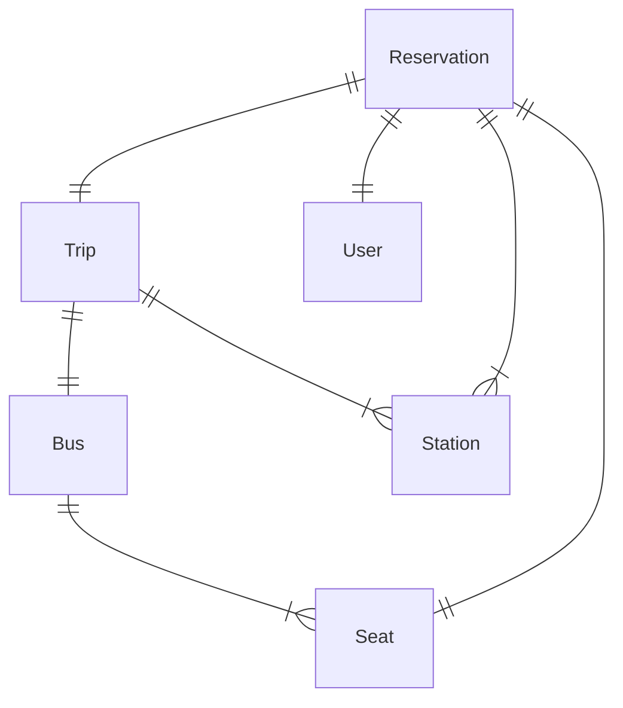
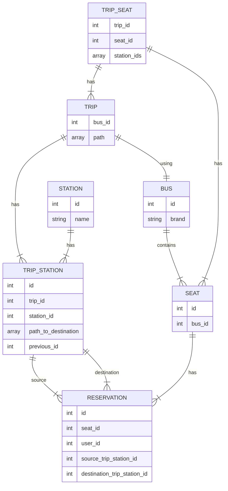
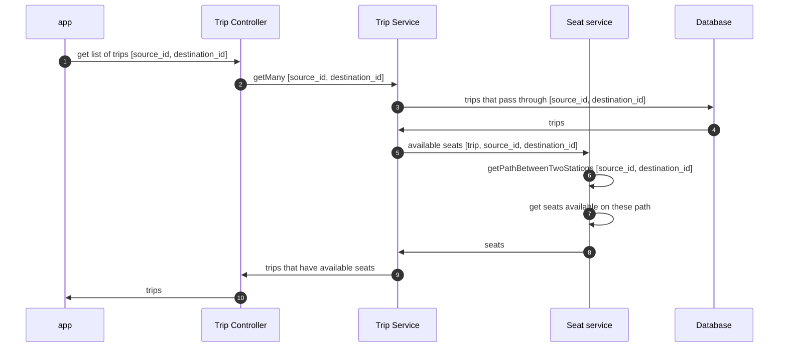
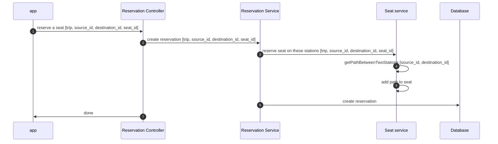

# Bus Booking System

## Requirements

 1. Egypt's cities as stations [Cairo, Giza, AlFayyum, AlMinya, Asyut...]
 2. Predefined trips between 2 stations that cross over in-between stations.
    1. ex: Cairo to Asyut trip that crosses over AlFayyum -firstly- then AlMinya.
 3. Bus for each trip, each bus has 12 available seats to be booked by users, each seat has an unique id.
 4. Users can book an available trip seat.

## Design



### ERD



## Sequences

### get a list of trips that have available seats


### reserve a seat on a trip


### api documentation

#### get list of trips

- method: `GET`
- uri: `/api/trips?source_id=1&destination_id=2`
- header: `Bearer Token`

- response:
  ```json
  [
    {
        "id": 2,
        "bus": {
            "id": 2,
            "brand": "inventore"
        },
        "seats": [
            {
                "id": 13
            },
            {
                "id": 14
            },
            {
                "id": 15
            },
            {
                "id": 16
            },
            {
                "id": 17
            },
            {
                "id": 18
            },
            {
                "id": 19
            },
            {
                "id": 20
            },
            {
                "id": 21
            },
            {
                "id": 22
            },
            {
                "id": 23
            },
            {
                "id": 24
            }
        ]
    }
]


#### book a seat on a trip

- method: `POST`
- uri: `/api/trips/2/reservation`
- header: `Bearer Token`
- request:
  ```json
  {
     "source_id": 1,
     "destination_id": 2,
     "seat_id": 13
  }
  ```
- response:
  ```json
  "seat booked successfully"
  ```

#### login

- method: `POST`
- uri: `/api/login`
- request:
  ```json
  {
     "email": "admin@gmail.com",
     "password": "password"
  }
  ```
- response:
  ```json
    {
      "id": 1,
      "token": "4|g2MOB40k80T2uyATxNhZHv4pr4SokXtdAzZPnKZ4"
    }
  ```
  
### set up the environment
1. create MySql DB `bus_booking`.
2. create `.env` from `example.env`.
3. run command `composer install`.
4. run command `php artisan vendor:publish --provider="Laravel\Sanctum\SanctumServiceProvider"`.
5. run command `php artisan migrate --seed`.
6. run command `php artisan serve`.
